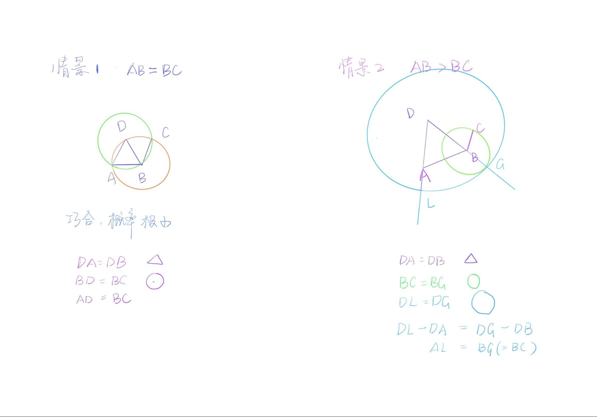

# Discussion II (Prop2)
>To place at a given point (as an extremity) a straight line equal to a given straight line.

Today we will discuss Proposition 2 together.

Alex first tried to prove this proposition by himself. His first attempt is to draw the point A and the line BC, and then use a compass as a medium to transfer the same distance as BC to the point A. After determining the two endpoints, the resulting line segment is equal to BC and A is one endpoint. It seems that in addition to the compass, a ruler can also help to achieve this transfer. However, it is important to note that the ruler was not marked in ancient Greece, and it was only used to assist in getting "straight", not to measure on a scale. So let's exclude the ruler option here.

Based on Alex's solution here, we need to understand why Euclid did not use a compass to "move" the line, instead, Eculid wrote a proposition to accomplish this task. I discuss this with Alex.

To be short, there is no relative system that can guarantee the invariance of the quantity when the compass is used as the carrier of the quantity to be shifted. Unless we add a postulate in the beginning of the book, specifically for the application of this tool, to make similar actions universal. But this is excluded in Euclid’s consideration, because we can see the role of both the pass and the ruler is just to draw. Their missions do not involve the measurement of size etc. The compass is meant to draw circles, though we can be clever and take advantage to do other things, any function other than drawing circles is not recognized. Thus, here we choose to prove.

If we go farther, let's think about how geometry is related to the real world. In our observation of real life, are all the geometry shapes/objects geometric in the absolute sense? For example, if the cover of a book is worn and creased, is it still a rectangle? We often say that geometry is abstract, we can even say conceptual, that is, it is difficult to find absolute existence in life, while concrete things (figurative) connected to it are everywhere. Tools are more connected to figurative existence. In abstraction, without frame of reference, without judgment and means of verification, can we all agree to recognize that a certain act of transfer in humans’ minds is universal? Hardly.

With Alex, we understand that the attempt of the compass may be operable in present life, but not in a rigorous abstract construction. Then we go back to Euclid’s proof of Proposition 2.
The proof of Proposition 2 is not difficult, but there are two things about this problem that are worth taking a closer look.

The first interesting question is about the inequality of the information contained in the image and the text. What does this mean? In Proposition 2, the comparison of the length of the given line segment BC and the connected line segment AB directly affects the presentation of the image. That is, the three cases of AB greater than BC, AB equal to BC and AB less than BC correspond to the three images, but the change of the images does not affect the writing of the text. In addition to the original editor's illustration, there are two other possible illustrations.

```{r echo=FALSE, out.width='100%'}

```

If we label the three cases with an equation, we will find that the magnitude of the quantity does not affect the logical reasoning either. 

**Equivalence (AB=BC)** <br>
Since BC=BD and DB=DA, DA=BC<br>
(Note that here it is not possible to write AB = BC directly)

**AB > BC**<br>
Because DL = DG, DA = DB, so AL(DL-DA) = BG(DG-DB)<br>
and because BG = BC<br>
So AL = BC

**AB < BC**<br>
Because DL = DG, DA = DB, so AL(DL-DA) = BG(DG-DB)<br>
and because BG = BC<br>
So AL = BC

In this way, what kind of information does the image convey to us?

The second part that I want to introduce to Alex here is an example of how to understand a geometric proof by memory, using Proposition 2 as an example. Looking at the complete argument of Proposition 2 and it contains a very long text. But in the way we convert it into a formula, the things become more clear though the letters are not good to remember. How can we master this proof completely? Although in answering the first question, we have just concluded that images do not generalize propositions, yet images are a great memory aid here.

```{r echo=FALSE, out.width='100%'}

```

We can simplify the complete figure, and only memorize the most central part, i.e. the two sides plus the small tail next to it. After that, think about the two sides being the radius of a certain circle(blue), the small tail and a part of a certain side also being the radius of another circle(green), the remaining part of this side and a part of another side being equilateral(orange), so the remaining side of another side is equal to the small tail. Thus the entire reasoning of the proposition can be recalled by the color line segment. Any geometry problem must have its core points and lines, and key auxiliary lines, and the most important part of learning geometry is to grasp the key points and the structure. Once you can grasp the structure of the proof through images, then the whole problem will be solved easily.

**Open assignments：**

Image Vs words <br>
Find a story book that includes words and images, randomly pick a page, try to identify the key corresponding demonstration. Then, only read the words, imagine an image in the mind, switch to looking at the image, and try to describe it by words.
