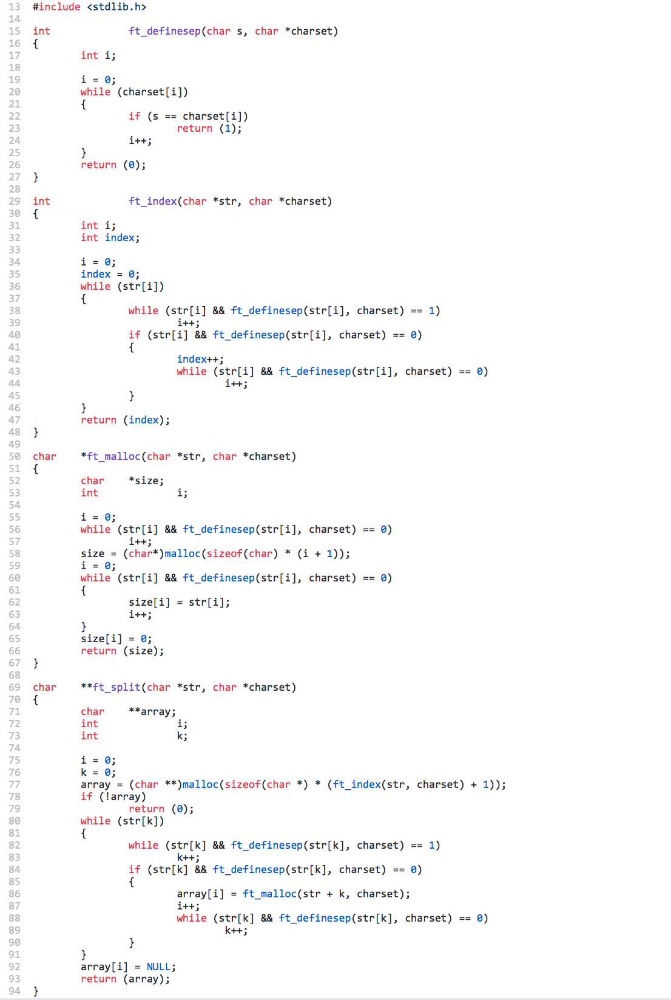
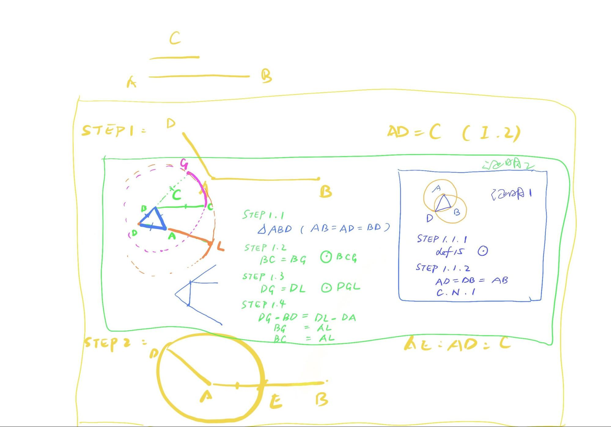

# Discussion III (Prop3)
>Given two unequal straight lines, to cut off from the greater a straight line equal
to the less.

Today we will look at Proposition 3, which is very short, and yet today we are discussing how to understand its simplicity, and firstly, we check a programming example of ft_split.

(Background knowledge: ft is short for function, ft_split means the function to split strings of characters, in other words, it is a programming function to split letters of words. I wrote it in 2019 for an exam. )


```{r echo=FALSE, out.width='100%'}

```

This example is written in the programming language C. Of course, the focus of this lesson will not be on understanding the content of this code, but on its analogy of format with Euclid's Proposition 3. Let's take a look at it.

First of all, the first line has an include stdlib, which means that in the following code a function (malloc) will be called from the library stdlib. If there is no header in the first line, then when the line of code malloc in ft_malloc is running, an error should be reported and it is not possible to proceed, because none of the functions related to malloc can be called. Does this make you think about something similar in Euclid’s Elements? Yes, libraries correspond to the set of definitions, postulates and common notions in Euclid's mathematical system, except that there are a large number of definitions in C. The definitions are grouped according to their functionality, and they are called only when needed.

After the headline, there are four separate "loops", easy to separate them by a line following {}.In this project, the first three loops are small loops, and the last one, **char ft_split(){}, is the main loop. Now we look at the code and I tell you that the order cannot be changed. Because you can find that ft_index(){} references ft_definesep(){}, then *ft_malloc(){} references ft_definesep(){}, and the last **ft_split{}() references all first three ones. If you switch any one of the functions to mix the order, the code will report an error. This is because the computer reads the code linearly, and if it runs to an "ft" that has not been defined before, the computer will report an error since it cannot understand what it is trying to do.

The same is true for Euclid. Proposition 3 is short because proposition 1 and 2 are pre-populated. Proposition I, II, and III are placed on the same page and headed with a statement containing the defining postulate and common notion, so that Proposition III becomes fully operational. If propositions I and II are not deliberately listed separately, then they should be inserted into proposition III, like the following.

```{r echo=FALSE, out.width='100%'}

```

Here comes an interesting discussion, under what circumstances a module has to be put separated? It challenges us both in the following two different situations: In Euclid's proof, why should Proposition I and Proposition II stand out separately? Even writing them into Proposition III does not lead to excessive length. In our code, why can't we write all the small loops into the big loop and call them separately when we use them?

Because there are a group of certain lines of code that are too commonly used, instead of writing them repeatedly each time, it is better to list them separately in advance and call them with a single command while in demand. For Alex, who has experience with C++, it is not very difficult to understand this, but I imagine that it could take time for kids who have no experience of coding. 

It shares the same principle in Euclid's geometric proofs. If we know that a certain part will be used frequently, then we need this part to be written out as a prior proposition for subsequent use. Euclid's Elements can even be considered as a complete collection of the original programming code. Thinking about writing thousands of lines of code manually and calling each proposition from memory, doesn't it make you understand more about the transcendence of this book for its century?

Next time, we will discuss Proposition 4, and there is an important difference between Propositions 1 to 3 and Proposition 4. The first three propositions are actually "drawing", drawing a triangle, drawing a line segment, intercepting a line segment. The aim is to construct. But Proposition 4 is a proof without construction. In the next lesson we'll look at the key role of logical reasoning.

**Open assignments：**

In daily routine, what advanced grouping activities can be helpful? <br>
(This question aims to guide students to think about their daily routine and improve its efficiency. Examples: Prepare the clothes of a week, to save time in the morning for selection, buy milk for a week instead of passing the grocery store every day. )
