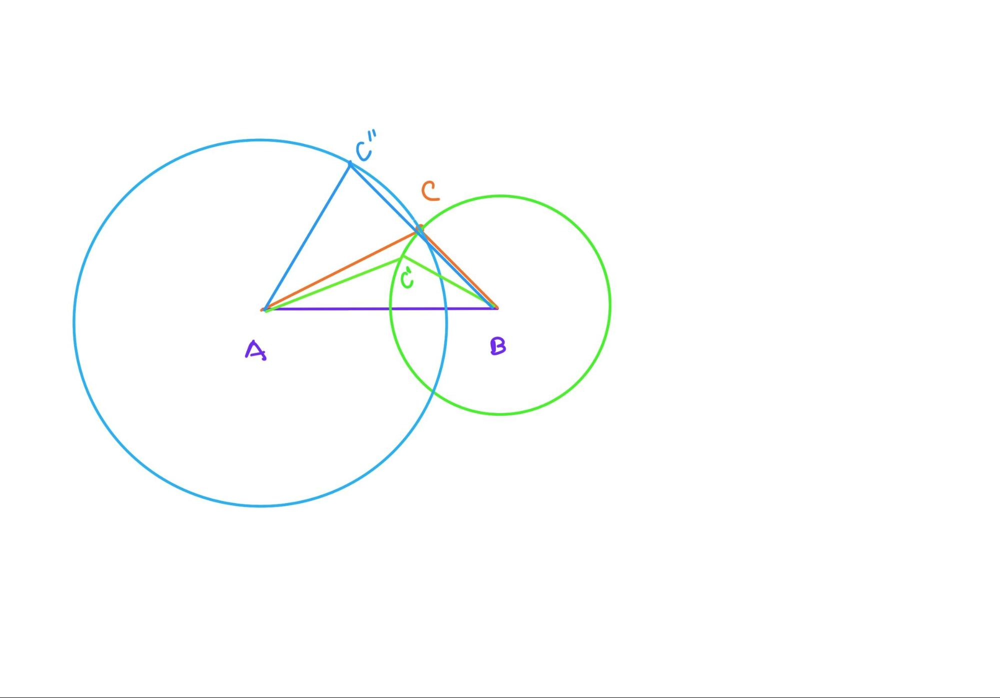

# Discussion VI (Prop 6-7)

## Proposition 6
>If in a triangle two angles be equal to one another, the sides which subtend the equal angles will also be equal to one another.

Today we plan to study Proposition 6 and 7 and we will encounter Reductio.

Proposition 6 is about proving that equal angles lead to equal sides in a triangle. It uses the reductio ad absurdum method, that is, the converse way of proof, which proves that equal angles must lead to corresponding equal sides by denying the other possibility that equal angles could have unequal corresponding sides. The previous proofs were all forward-order proofs. It's like a material and a model. The previous proofs are to build up the final model from the material little by little, while this proof is to dismantle the model and see if we could dismantle the material differently than expected. What is more interesting here is that we reflect on our own acceptance and discuss whether the two approaches are equally convincing.

For Alex, either the forward or reverse proof is acceptable as long as the logic is unquestionable. For me, I might subconsciously wonder why I can't prove it forward firstly, is it only provable in reverse? I invite Alex to try to prove the problem without reductio ad absurdum, but in normal order. We drew the diagram and reflected together, but we could not find a completely suitable idea. Alex proposes to use a special method, that is to set an isosceles triangle as a right angle isosceles triangle, and then by calculating sin45 degrees to show that the two sides are equal. Although this method is very advanced here, it shows how Alex has applied what he learned in school.

The fact that we didn't find the right geometric idea doesn't mean that this problem can't be proved without reductio, but at least our attempts indicated the difficulty, and it seems that the reductio ad absurdum is easier to be applied here. So if we must use the converse way, what should we pay attention to? Probably like the name says, the reductio ad absurdum, while reducing the statement, we need to check all cases and negate all other possibilities to identify the desired unique solution.

## Proposition 7
>Given two straight lines constructed on a straight line [from its extremities] and meeting in a point, there cannot be constructed on the same straight line [from its extremities], and on the same side of it, two other straight lines meeting in another point and equal to the former two respectively, namely each to that which has the same extremity with it.

The statement of Proposition 7 is a bit convoluted, but to explain it in a simpler way, it says that if you find an arbitrary point on one side of a line segment, you cannot find a second point that makes the new line segment equal in length after joining the two endpoints of the segment.

The method here is still reductio ad absurdum, the proposition is not difficult to understand, and Alex and I quickly review Euclid's proof together. It is worth noting here that Alex proposes his own reductio ad absurdum method, which uses motion trajectories and drawing circles to illustrate, as follows.

```{r echo=FALSE, out.width='100%'}

```

Draw a circle with A as the center and AC as the distance; draw a circle with B as the center and BC as the radius. If the BC distance is constant, point C must move on the arc, and the distance between any other point and A must change, either larger or smaller, because circle A and circle B have only one intersection point on the same side of AB. Similarly, if the distance of AC is constant, the distance of BC changes. Therefore, no second point can be found on the same side of AB to keep AC,BC constant.

Alex's method of proof is to solve the problem from the point of view of motion, which is very open-minded. At the same time, Alex also mentions when proving this proof that if a second point can be found so that the connected line segments are equal, then it is on a three-dimensional space, not on a plane. In other words, Alex has noticed the unspoken precondition for these propositions, "plane" geometry.

Learning this proposition, it is easy to question why we need this proposition and it seems that we cannot see a clear objective. Recalling our memory of the programming case of Discussion III, it is not difficult to surmise that Euclid is setting the stage for following propositions. It is just not clear what the proof is being prepared for. This is actually true in life as well, where some things may seem to be meaningless in the moment, but are actually part of life afterwards. By studying these propositions, it helps us understand at least two things: one is dismantling; and the other is preparing. Breaking down large tasks to a level that can be accomplished, some preparation tasks may not make sense in the present moment.

**Open assignments:**
 - Introduce the game Sodoku and ask how the reductio strategy works while playing this game.
 