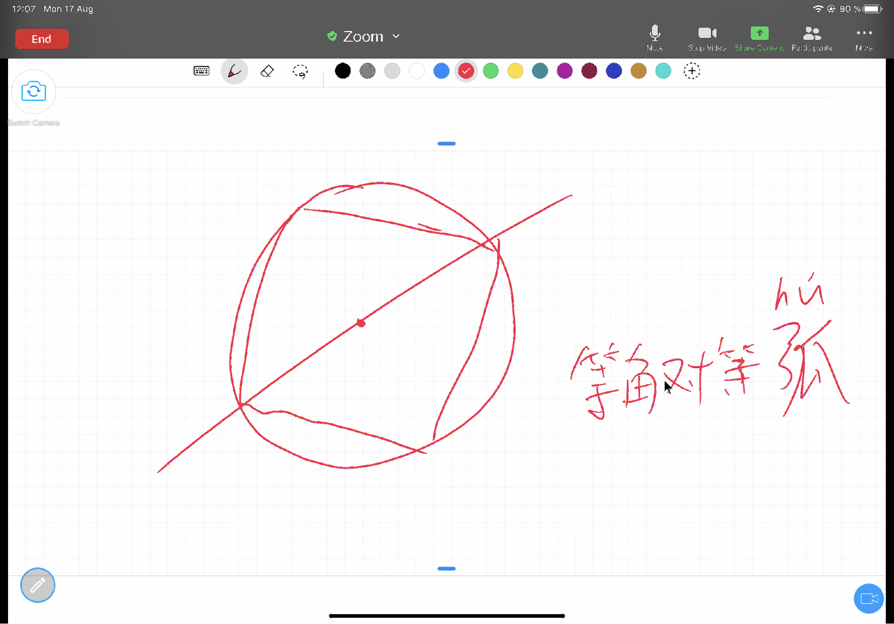

# Discussion VII (Prop 8-11)

As Alex becomes familiar with Euclid's proof, and because of the repetitive nature of the proof form, we will pick up the pace slightly in terms of content. In this class, we discussed proposition 8 to 10 and skim proposition 11.

## Proposition 8
>If two triangles have the two sides equal to two sides respectively, and have also the base equal to the base, they will also have the angles equal which are contained by the equal straight lines.

Alex first tries to prove it himself. In his first attempt, Alex chooses isosceles triangles, and here there's a misunderstanding in the meaning of the question, and he does not read the question carefully enough. The two corresponding sides of the two triangles equal to each other, it does not specify isosceles triangles, but rather that there are two triangles whose sides correspond to each other equally, and what Euclid is trying to prove is a general theorem.

(green: special case of isosceles triangles; 
purple, general generic case, which can be acute/obtuse/right/isosceles/equilateral triangles, etc.)

```{r echo=FALSE, out.width='100%'}
knitr::include_graphics('./image/07-prop8-image9.jpg')
```

Since Proposition 7 becomes a part of this proposition and plays a key role in the reasoning, Alex also claims that he now understands the purpose of Proposition 7 better, as a necessary component of Proposition 8. This was expected by yesterday.

##Proposition 9
>To bisect a given rectilineal angle.

The next proposition is about drawing the angle bisector, which we have skimmed in earlier classes. Today I ask Alex to prove carefully again, and we will find that the logical framework of this question is as follows:

isosceles triangle, equilateral triangle, congruent triangle => angle bisector. 

Thus, this proposition requires 3 layers of preparation. The two waists of the isosceles triangle are equal, the two sides of the equilateral triangle and the connected common side together to meet the condition of SSS method to prove congruent triangles.

This short and simple proposition actually shows us the skill of doing auxiliary lines. Auxiliary lines are the key to solving mathematical geometry problems, and if you draw the right auxiliary lines, the geometry proof will be easy to write. Sometimes it seems like it takes more than one attempt to find the right one, but if you understand the purpose of the auxiliary line, you can apply a reverse-order reasoning method to find the correct one. For example, in the example of Proposition 9, the ultimate purpose of the question is to divide an arbitrary angle equally. It is natural to think that the two angles being equally divided are each part of a certain triangle, and by congruence it can be inferred that the corresponding two angles are equal. In order to construct congruent triangles, then, in addition to the common side of the bisector, equilateral and isosceles triangles are needed to construct the known condition that the corresponding sides are equal. In this way, the auxiliary lines must be associated with equilateral and isosceles triangles, and we need to draw equilateral and isosceles triangles with the auxiliary lines. When you are lost to find the auxiliary lines in a math problem, you may want to work backwards from the conclusion to see what additional images are needed, those additional theorems and properties to aid in the proof, and so the auxiliary lines are found.

This question discusses the concept of bisection, and we can go back to Definition XVII to see what happens there.

>Definition XVII: A diameter of the circle is any straight line drawn through the centre and terminated in both directions by the circumference of the circle, and such a straight line also bisects the circle.

Definition XVII says that the diameter divides the circle into two. Is the diameter equally divided? Why didn't Euclid prove it? Yes, he says that the circle is divided into two, and this implies an equal division. I ask Alex to think about why a proof is not needed for the equal division of a circle, and Alex says that the diameter draws two linear angles, both 180 degrees, so the two parts are the same. So how do you prove that the two arcs are the same? The default here is equal angles to equal arcs. Then why do we need to prove equal angles to equal sides in isosceles triangles?

Alex’s cyclotomic method

```{r echo=FALSE, out.width='100%'}

```

## Proposition 10
>To bisect a given finite straight line.

Then we briefly go over Proposition 10, which is a continuation of Proposition 9. It is not difficult because it applied the same method as Proposition 9, to deduce the bisector of a line backwards through congruent triangles. In addition, this is part of the “isosceles triangles three lines one theorem”, where the angle bisector and median coincide.

## Proposition 11
> To draw a straight line at right angles to a given straight line from a given point on it.

In fact, doing demonstrations in class can also reveal the child's personality, like Alex, the more difficult and challenging the topic is, the more motivated he feels. Simple problems are more likely to be passed by. For example, Proposition 11, Alex draws the vertical line directly, which was also influenced by his school math class, but we hadn't actually proven how to draw a vertical line. Proposition 11 is a continuation of the above two questions about the “isosceles triangles three lines one theorem”. Here, we follow up the previous question with the median, and then prove that in an equilateral triangle, it is also the perpendicular that can be drawn. Therefore, the order here is: Angle Bisector => Median => Perpendicular line.

For geometry problems in mathematics, it is true that the idea is very important, with the idea, basically a problem is solved, but the expression is also as important, because even if the thing is 100% done, the final expression is presented by 50% only, then we may only recognize 50% of it and the skipped part would not be recognized. At the beginning of the next lesson, we should go over this proof again, without skipping steps, and following the format. The aim is to review the thought structure as a whole and take a close look on Euclid’s expression.
