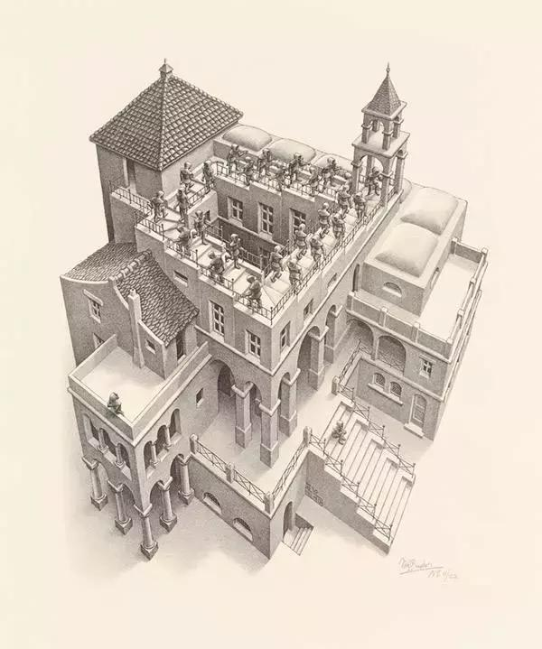

# Discussion X (Prop 17-20)

Today we discuss propositions 17,18, 19 and 20.

## Proposition 17
>In any triangle two angles taken together in any manner are less than two right angles.

For Proposition 17, Alex presents his idea: If there are two right angles, then the two lines are parallel and will not intersect, and they cannot form a triangle either. Thus, any two angles in a triangle must be less than two right angles. As written in Postulate 5, where the sum of two interior angles is less than two right angles, they must necessarily intersect on the same side. Naturally, if they necessarily intersect, then there must be a triangle. For Postulate 5, if two angles are greater than two right angles, then the other side is less than two right angles, which means that the other side will intersect. But it ignores the case where the interior angle is equal to two right angles. If we look at definition23: Parallel straight lines are straight lines which, being in the same plane and being produced indefinitely in both directions, do not meet one another in either direction. In this definition, there is no mention of the special properties when intersecting a third line perpendicularly and thus, we still need to prove it. Here the question becomes: can we derive Proposition 17 directly by applying Definition 23 and Postulate 5?

This question is not easy to answer. If we look at this logic chain, we find that the most difficult step is still the first step: 

two right angles => parallel lines  => No intersection (Definition 23: the property of parallelism) => cannot construct a triangle (Definition 19, which requires three sides to form a triangle). 

The key then is whether right angles => parallel lines can be introduced through the Postulate 5.

Can we introduce two right angles => not intersecting on either side => parallel? The key here is the "two right angles => no interaction" step. This is the logical p->q, whether we can get ﹁p→﹁q (﹁ means negation), that is, whether "not two right angles => intersect" is equivalent to "two right angles => do not intersect". But logically, p→q ≡ ﹁q →﹁p, i.e., the equivalence of "not two right angles => intersect" is "no intersection => two right angles", which is different from "two right angles => no intersection".

Here I introduce to Alex the additional logical relations among p->q; ﹁p→ ﹁q; ﹁p→﹁q:

p->q, which shows that p is a sufficient condition for q. That is, it is raining today and the air humidity is high. We do not conclude that it is not raining today, then the air humidity is low, because in fog, snow, etc. can lead to high air humidity. But we can say that the air humidity is low and it is not raining today. High air humidity is not necessarily caused by rain, but low air humidity must not have rained.

Thus under the condition that Postulate 5 holds, we can't say "two right angles => parallel", but we can say "parallel (not intersect) => interior angle and two right angles (not less than two right angles)".

In fact, we just need to switch the conditions and conclusions of Postulate 5, which is Proposition 17.

>Postulate 5: That, if a straight line falling on two straight lines make the interior angles on the same side less than two right angles, the two straight lines, if produced indefinitely, meet on that side on which are the angles less than the two right angles.

Counterpoint: If two lines extend infinitely to intersect on one side, then the sum of the interior angles resulting from the intersection with the third line is less than two right angles.

>Proposition 17: In any triangle two angles taken together in any manner are less than two right angles.
The only slight difference, if any, is that the two lines intersect and also make up the triangle with the third line.

So Postulate 5 and proposition 17, when put together, seem to be statements of mutual sufficient and necessary conditions, except that one has no way to prove it, in the form of Postulate, while the other, at a later position, is already provable. I think the reason for not stating Proposition 17 as a Postulate here is also to reduce the postulate as much as possible. After all, as we explained in the set of Propositions 13 and 14: the mutual sufficient and necessary condition is also proved rather than tacitly assumed to exist. For proofs, we try to use as few controversial postulates as possible to enhance persuasiveness.

## Proposition 18 & 19

>Proposition 18: In any triangle the greater side subtends the greater angle.
>Proposition 19: In any triangle the greater angle is subtended by the greater side.

Let’s see another example of the pair Proposition 18 and 19. They are again a set of sufficient and necessary conditions for proving each other. In terms of the manner of argument, Proposition 18 is a positive proof based on the previous proposition. As for Proposition 19, we can take a closer look at its logic.

Proposition 18 says that the long side -> the large angle. That is, short side -> small angle.

It is worth noting that "long side -> large angle" and "short side -> small angle" are tautologies. It may seem at first glance that ﹁Long side → ﹁Large angle is equivalent to  Short side -> Small Angle, but it is not. There is a misunderstanding here, because the conditions omitted from Proposition 18 are: equality and inequality. Condition is in fact - in an arbitrary triangle, if any two sides are unequal, then the conclusion is that the longer side is corresponding to a larger angle. Thus the short side to the small angle and the long side to the large angle are both conclusions and they are tautological, not antithetical negation.

Thus Euclid used Proposition 18 to prove Proposition19 with the statement that the short side -> small angle, i.e., the tautological repetition of the original proposition:

 - Original: Neither is AC less than AB, for then the angle ABC would also have
been less than the angle ACB; [I.18] but it is not, therefore AC is not less than AB. 

 - Interpretation: AC must be greater than AB because if AC is less than AB, then angle BCA is smaller than angle ABC. But now angle BCA is larger than angle ABC, so AC is greater than AB.

While doing this practice, Alex suggests that because a straight line is the shortest between two points, the sum of any two sides of a triangle must be greater than the bottom side of the line connected between the same two points. The problem, however, is that the theorem of the shortest straight line between two points is itself an extension of Proposition 20, and there is no such definition, postulate or common notions. We only say that there must be (at least) a straight line lying between two points, but we never say that this distance is the shortest in all cases. Proposition 20 is actually a side note to explain this problem, it has compared the case of one straight line and two straight lines. So Proposition 20 cannot be proved in reverse by using the shortest between two points as a straight line, because it requires a supplementary proof, such as a comparison of curves and straight lines, polylines and straight lines, and so on. Thus we need to pay attention to the distinction between perceived or intuitive phenomena and the proved ones.

## Proposition 20
>In any triangle two sides taken together in any manner are greater than the remaining one.

In this propositions, we find that Euclid often uses triangles and line segments as a medium to transform and fill in the quantities which need to be compared and proved, and then applies the previous propositions to complete the proof. This method is common and applicable in middle school geometry: creating equal angles, equal triangles, common sides, equal line segments, etc. to aid in the proof. If there are questions that you do not know how to solve, you can start by trying to add auxiliary lines in order to construct equal angles, equal sides, and equal triangles.

**Open Assignment:**
 - At this point we also ponder the question whether we can trust our eyes and whether what we see visually is real? Referring to the example of the work "Rise and Fall" by the genius painter M.C. Escher.

```{r echo=FALSE, out.width='100%'}

```
