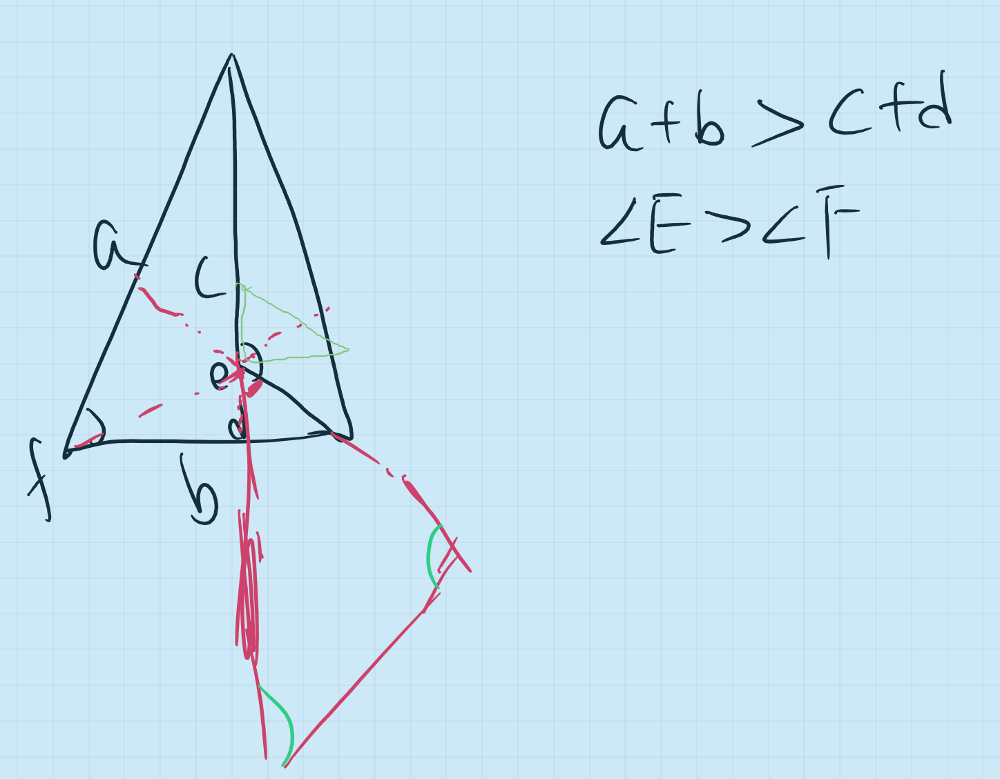

# Discussion XI (Prop 21)
## Proposition 21
>If on one of the sides of a triangle, from its extremities, there be constructed two straight lines meeting within the triangle, the straight lines so constructed will be less than the remaining two sides of the triangle, but will contain a greater angle.

There are different ways to learn Euclid's proofs and the two most commons are: one is to read along with Euclid's ideas, preferably closing the book and deducing them for yourself afterwards, while the other way is to just read the statement, refer to the picture as needed, and then figure out how to deduce it for yourself to see if there is a known way to launch the conclusion.

Today's class is a challenge, partly because we try to discuss things in English(usually in Mandarin). Alex is making progress but still his speech is limited. Then we also choose the second method, hoping to think by ourselves to launch Euclid's proof. By proofing, I hope Alex will understand the difference between creating and following, and also the help (auxiliary lines) we can find in creation.

If we read Element, we always feel that the propositions are not difficult and the logic is very smooth, however, only when we try to prove it ourselves, we realize that the smoothness of the logic does not mean that the clues are obvious. Information is like pieces, even if we are sure that we can finally assemble it into a beautiful collage, the outline and lines of the college are not so easy to determine. Alex and I spent an hour of class today working on just this one proposition.

There are two keys in this proposition: one is the auxiliary line, and the other is to specify the theorem to be invoked.

Let's look at the problem first: " If on one of the sides of a triangle, from its extremities, there be constructed two straight lines meeting within the triangle, the straight lines so constructed will be less than the remaining two sides of the triangle, but will contain a greater angle." Here you need to compare two different sets of objectives, one set is the sum of two sides and the other set is two angles. Different theorems are called to compare sides and angles, respectively, and the first twenty propositions do not have many theorems for comparing sides and angles, especially since the last proposition-Proposition 20-talking about the sum of two sides of a triangle being greater than the third side, is very likely to be used here. The previous proposition, about the size of the angles, there are comparisons of the opposite angle, the exterior angle, and the interior angle of the triangle. The proposition about the right angle can be put aside for now, because once it is a right angle, the triangle is restricted, and the statement of this proposition is obviously for triangles in general.

Setting aside the propositions that can be chosen, the next question is that of auxiliary lines. We have been emphasizing the skill of choosing auxiliary lines, and the central point is to understand the role of auxiliary lines. The auxiliary line, as the name suggests, helps to complete the proposition, and this help is a kind of bridge, in other words, the auxiliary line is a medium that helps us to move from the known to the required proof. If we don't find the bridge from the known to the required quickly, we can start with different attempts, that is, as Alex and I said, just draw, draw all the possible auxiliary lines you can think of, and then we will compare and analyze their usefulness in this proof.

Alex made the following diagram: (red is the auxiliary line)

```{r echo=FALSE, out.width='100%'}

```

Because, at the end, the auxiliary line must act as a medium, and medium means transition, because most of the auxiliary lines complement the original image as much as possible, rather than making major updates, in other words, the auxiliary lines tend to expand to a limited extent. The idea of Alex's auxiliary lines here is to jump too much, creating many new lines and angles that have been extended beyond the triangle. In fact, the red line already contains the auxiliary lines we would expect, yet it is also overlooked because it is so subtle. Both open-mindedness and attention to detail are essential in learning mathematics.

This is the time to ask Alex: what proposition/theorem/property is this auxiliary line associated with that can be applied? If there is no answer, we need to eliminate the auxiliary line, and in the process gradually recognize the qualities of the "medium" of the auxiliary line.

When we are able to connect the auxiliary line to the previous proposition, the structure of the proof becomes clear. In this case, the auxiliary line constructs an intermediate triangle, and then transitions the comparison of angles and sides from the new innermost triangle to the outer triangle. The comparison of the angles is relatively simple compared to the comparison of the sides. After the addition of the auxiliary line, the angles are the outer angles to the smaller triangle inside and the outer angles to the triangle outside, and this dual identity helps achieve the transition. The comparison of the sides looks complicated, but in fact it is also a combination of the use of the sum of any two sides being greater than the third side and the addition of inequalities, except that the intermediate medium takes a detour in its use.

By studying proposition 21 in detail today, I hope Alex will be able to better understand the addition and use of auxiliary lines.

**Open Assignment:**
 - In your previous homework, pick 5-10 geometric exercises which have been used in the process of proving, analyze how it has been made and how it helped achieve the transition.

