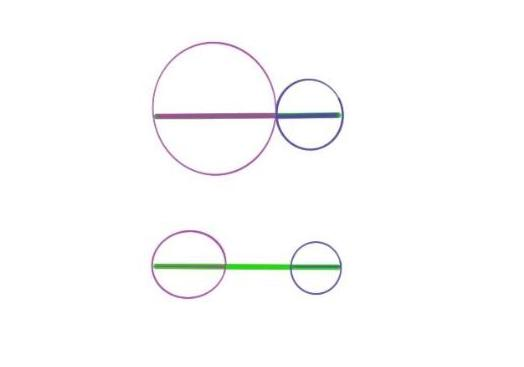

# Discussion XII (Prop 22-24)

In today’s discussion, we go through proposition 20 to 22.

Proposition 22 and Proposition 20 are a pair of proof of sufficient and necessary conditions. Previously we were talking about the fact that the sum of any two sides of any triangle is greater than the third side, while the next proposition 22 says that any three line segments must construct a triangle if the sum of two of them is greater than the third side. Also, Proposition 20 is a proof, while Proposition 22 is a construction.

## Proposition 22
>Out of three straight lines, which are equal to three given straight lines, to construct a triangle: thus it is necessary that two of the straight lines taken together in any manner should be greater than the remaining one. 

The proposition starts by drawing the given three line segments onto the same line, then taking the middle side as the base side, while moving the line segments to the position where the two circles intersect by using the property of equal radii of circles. The key to this proof is also the vertex of the new triangle constructed by the intersection of the two circles. Imagine what it would be like if the two circles did not intersect. Under what circumstances can the two circles not intersect to produce a vertex? No intersecting vertices is the equivalent of not being able to construct a closed triangle. That is, the case where the sum of the two sides is less than the third side. It is not difficult to understand, because if the sum of two sides is equal to the third side, then we see thickened line segments that overlap each other; while if the sum of two sides is less than the third side, it is an open line drawing and cannot be enclosed into a figure. As shown in the figure:

```{r echo=FALSE, out.width='100%'}

```

So what role does the circle play in this construction process? It is both a medium to pass equivalent line segments and a means to detect the relationship between two circles, intersecting, tangent, or not intersecting nor tangent, its equivalence to the relationship of three sides also determines the construction of the triangle.

## Proposition 23
>On a given straight line and at a point on it to construct a rectilineal angle equal to a given rectilineal angle.

Proposition 23 is not difficult, and the most worthwhile discussion here is the relationship between angles and triangles. Let's start with Alex's thought process on the relationship between angles and triangles, the first of which is that the interior angles of a triangle sum to one hundred and eighty degrees, and the second is that the exterior angles are larger than the other two interior angles. These first two are both properties of triangles, and the question we wish to touch on is what is an angle? Can it exist independently of the triangle? The reason for thinking about such a question is that in the proof, Euclid chose to construct the triangle and then prove that one of the angles is equal. Why do you do this?

Here the angle is defined with reference to Definition 8 and Definition 9:

>Definition 8: A plane angle is the inclination to one another of two lines in a plane which meet one another and do not lie in a straight line.

>Definition 9: And when the lines containing the angle are straight, the angle is called rectilineal.

Obviously, when defining angles at the very beginning, it is not necessary to place them in a figure enclosed by a straight line, such as a triangle. So what is the role of the triangle here?

The triangle is the equivalent of a medium here to allow us to apply the properties of the triangle we have learned previously to compare the angles contained in it. If we compare the angles directly, we could also make an argument in terms of displacement and coincidence, but obviously Euclid was trying to avoid such a proof. If one does not compare directly, one can also compare the angles in parts by slicing them, etc.The choice of triangles here is a way of filling in the smaller parts into the larger whole to facilitate identification. These possibilities represent different ways of thinking:

 - direct comparison method: that is, the object to be compared is compared visually and holistically
 - detail comparison method: the details of the object to be compared are divided as needed and compared one by one
 - filling comparison: The object to be compared is placed in a larger text/environment and selected by matching the whole or other parts.

Corresponding to real life, in the school system it is an intuitive comparison of overall scores; comparison of single subject scores; looking at rankings; if applying for a job, overall impressions; resume details; teamwork performance.

## Proposition 24
>If two triangles have the two sides equal to two sides respectively, but have the one of the angles contained by the equal straight lines greater than the other, they will also have the base greater than the base.

For proposition 24, we don’t have much to discuss. In fact, Proposition 24 and Proposition 21 echo each other. Proposition 21 looks at the size of the other two sides and the top angle after fixing the bottom side, while Proposition 24 looks at the change of the bottom side and top angle after fixing the lengths of the two sides.

The key to the proof of this proposition is to put the two sides to be compared into the same triangle and then prove the relationship between the lengths of the two sides by comparing the sizes of the corresponding angles.

**Open Assignment:**

 - Pick any admission/competition system and analyze the comparison framework under that system.
 - Specify a type of item to purchase (e.g., floor sweeper), analyze the products available in the market, select the product you would purchase and explain why.
