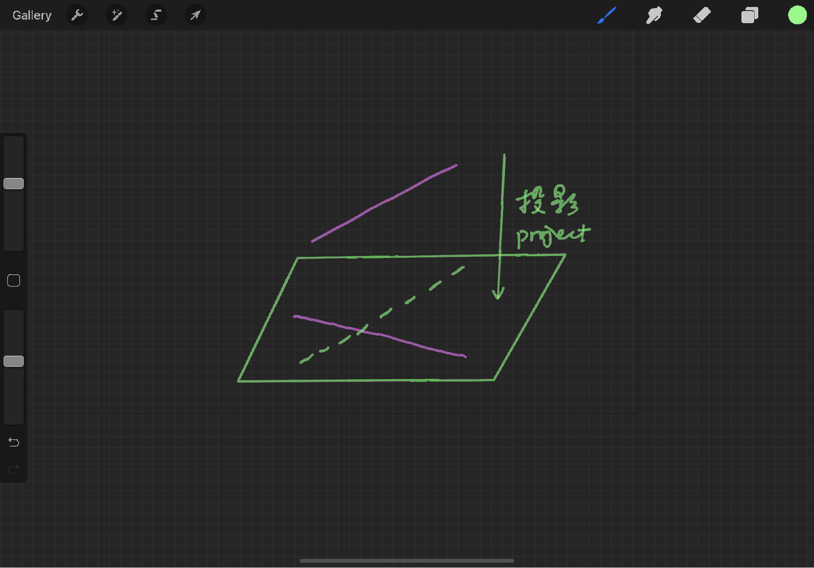
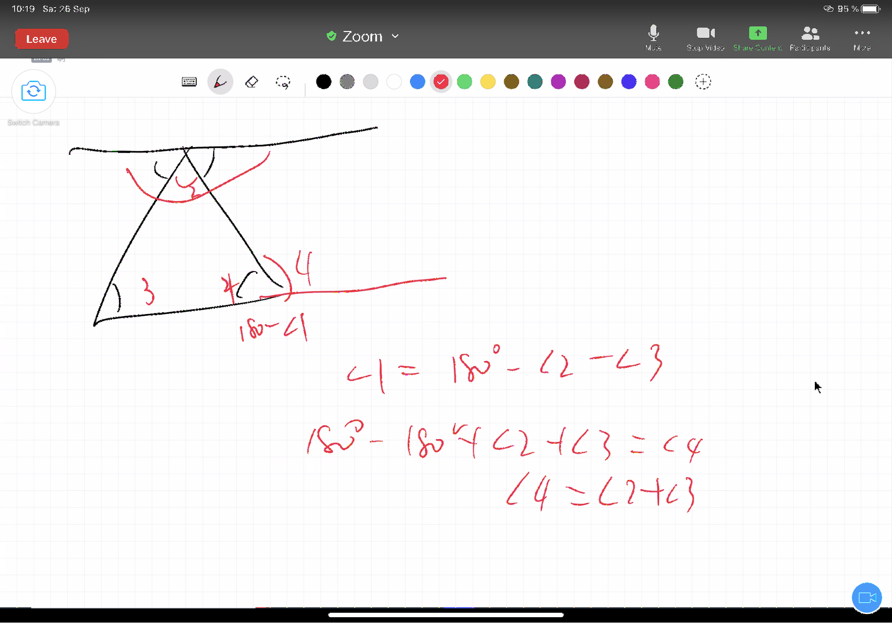

# Discussion XIV  (Prop 29-32)

In the previous lesson, we studied the conditions for determining parallel lines. Proposition 29 then discusses the properties of parallel lines and integrates the three properties in one proposition. Propositions 27, 28, and 29 form a set of sufficient and necessary conditions, the concept that we have learned in previous classes. 

## Proposition 29
>A straight line falling on parallel straight lines makes the alternate angles equal to one another, the exterior angle equal to the interior and opposite angle, and the interior angles on the same side equal to two right angles.

Proposition 29 applies a filling comparison method in which we need to prove equality by adding angles and combining them again.

## Proposition 30
>Straight lines parallel to the same straight line are also parallel to one another.

Proposition 30 is a further corollary using the nature of parallelism. Here we recall Common Notion 1: Things which are equal to the same thing are also equal to one another. This common notion is written in the same way as the statement of Proposition 30: "Straight lines parallel to the same straight line are also parallel to one another. " What does this tell us? Does the convincingness of this proof go beyond Common Notion 1? (Why does it feel as if it doesn't?)

Let's imagine that lines A and B each extend never to intersect, but that line C, the projection of line A onto line B, is parallel to A and intersects C. Don't be confused by this idea, however, because going back to the definition of parallel, (a parallel line is a line in the same plane that extends infinitely in both directions and does not intersect each other.) It is required that the lines be in the same plane. Even though proposition 30 does not spell out the implied condition of the same plane, it nevertheless exists, and thus this imagery is excluded from Euclid's world. Isn't it true that you always want to find a break in Euclid but end up admiring the rigor of the system?

```{r echo=FALSE, out.width='100%'}

```

## Proposition 31
>Through a given point to draw a straight line parallel to a given straight line.

The proof of Proposition 31 is easy and pleasant, and the question worth discussing here is whether one parallel line can be drawn passing a fixed point, corresponding to one line? What does this uniqueness mean here? When we were studying the definition of parallelism, we discussed whether we could replace the statement "two directions extend but do not intersect" with "the distance between the corresponding points on two lines is always equal". Can we sense the property that "the distance between the corresponding points on two lines is always equal"? Then why did Euclid not define it in this way? In my opinion, the problem goes back to Definition 4: A straight line is a line which lies evenly with the points on itself.

Euclid does not fully define the relationship between lines and points, we are not able to equate the equal distance between infinitely connected points to the distance between two straight lines. This great point-to-line gap is the difficulty in defining parallel lines.

Also, Proposition 12 (To a given infinite straight line, from a given point which is not on it, to draw a perpendicular straight line), the perpendicular line also seems to be unique and the perpendicular line is made by proving that two adjacent angles are equal to each other. Parallel lines, on the other hand, are proved by proving that interior angles are equal. In Proposition 22 we have seen the circuit from lines to angles to graphs, and the proofs here for drawing perpendicular and drawing parallel lines imply that the circuit from angles to lines is also connected.

## Proposition 32
>In any triangle, if one of the sides be produced, the exterior angle is equal to the two interior and opposite angles, and the three interior angles of the triangle are equal to two right angles.

Proposition 32 is a two-part proposition. It takes up Proposition 16 (In any triangle, if one of the sides be produced, the exterior angle is greater than either of the interior and opposite angles) and Proposition 17 (In any triangle two angles taken together in any manner are less than two right angles). We will find that when we finish proving Proposition 32, we won’t call 16 and 17 very often later, because it is included by default in what Proposition 32 involves: the outer angle is equal to the sum of the two inner opposite angles, which is naturally greater than either inner angle, and the sum of the three inner angles is equal to the two right angles, so the sum of any two of the three angles is necessarily less than the two inner angles.

Although it may seem that Proposition 16,17 to Proposition 32 is just a small step forward, the process is too arduous to be omitted. It's as if you've taken an umbrella from the skeleton to the top, seemingly just covering the umbrella, but the top requires a multi-step process to realize it before it can be put on the frame.

Regarding proposition 32, Alex comes up with a different method of proof on his own, which is also very feasible:

```{r echo=FALSE, out.width='100%'}

```

