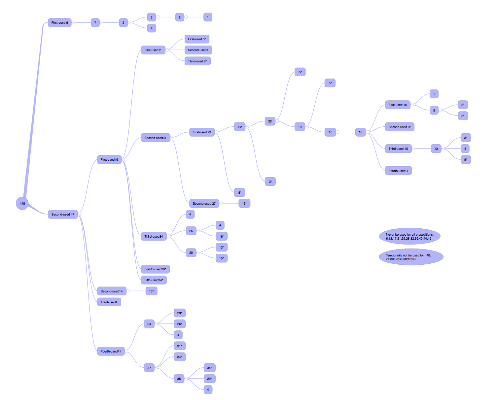

# Discussion XVIII  (Prop 46-48)

The three propositions at the end of Volume I are all related to squares, and the most important one is Proposition 47, which we know as the Pythagorean Theorem. When we talk about Proposition 47, we will add an understanding of the ancient Chinese method of proving the Pythagorean theorem and look at the similarities and differences between Chinese and Western thinking.

## Proposition 46
>On a given straight line to describe a square.

There is a trap in Proposition 46, and as expected, Alex stepped on it immediately. Because drawing a square is not a difficult task, it's just a matter of repeating the drawing of right angles and cutting equal line segments. The trap here is that after drawing it, you have to prove to the reader and audience that it is a square. At first glance it seems a bit confusing, but it actually means that we will first identify four points and three sides, and the last side is obtained by joining two points, then we need to add the information that proves the two right angles related to the last side and that this side is equal to the other three sides. If you say that your last side is also obtained by drawing right angles, or making equal line segments, then you need to prove that two line segments made perpendicular from each of the two bottom edges will in fact recombine into one, which is what you have drawn. Or you prove that a line segment from a vertex that is equal to the remaining three sides, the other endpoint of this line segment coincides with a known endpoint, i.e., exactly the other of the three known vertices. No matter how you treat them, it seems that the overlap reasoning of the latter two proofs require reductio ad absurdum method, which is troublesome and the persuasive is not more powerful than direct proof, so we will still choose to connect the two endpoints to make up the last line segment, and then directly prove that all four angles are right angles, all four sides are equal, then the graph is a square.

Here's an interesting question about moments: did the square become a square when you finished drawing the line segments, or did it become a square after you finished the proof? How should this moment of factual completion and the moment of argument completion be understood?

Here, what I want Alex to think about is the meaning of communication and the value of language. It is as if a herb medicine has been in the mountains and no one has told the herbalist that it is in fact a herb medicine and has all kinds of magical properties. Then the herb medicine is not a "medicine" but a "plant" until it is defined and popularized, and you will find that at this time, things are defined by the user, not by their existence. By the same token, in this problem, when the drawing is finished, we have drawn a figure because it is not yet "recognized" as a square, but when we have finished proving it, it really "is" a square. (The meaning of education, diploma, skill certificate in life is also the same.)

## Proposition 47
>In right-angled triangles the square on the side subtending the right angle is equal to the squares on the sides containing the right angle.

Proposition 47 is the culminating part of Volume I. The proof is completed by the correspondence between the areas of parallelograms and triangles. This proposition mainly invokes Proposition 41 and Proposition 46, where the previous proposition - Proposition 46 - is basically unrelated to the recent ones and can be understood as written separately for Proposition 47. And propositions 42 to 45 are mainly working on re-creation (the non-constructed propositions are also preparing for the constructed propositions). Therefore, Proposition 47 is a question in the main line of proof, if we consider "re-creation" as a branch of the proof in Volume 1.

```{r echo=FALSE, out.width='100%'}

```

Taking Proposition 48 at the end of the first volume backwards through the references, the line of logical development can be seen. The main line is naturally the longest one, and this longest line of proof ends with Proposition 1. Other different lines of proof have their own purpose in the proof of 47.

## Proposition 48
>If in a triangle the square on one of the sides be equal to the squares on the remaining two sides of the triangle, the angle contained by the remaining two sides of the triangle is right.

The reason for this lineage is to show how the western Pythagorean theorem progresses from zero to the completion of the proof in the middle of the process. The ancient Chinese method of proof, on the other hand, is very different, taking Liu Hui's cut-and-patch technique as an example. (Picture?) The characteristic of the cut-and-patch technique is that it starts from a practical point of view and completely omits the construction of the abstract world, so it does not need a series of proof definitions to lay the groundwork, it just gives the figure and uses the piecing method to prove it. And it assumes the meaning of visual cognition, thinking that it can directly determine the equivalence of different parts of "in" and "out" without giving a proof. The ancient Chinese method is relatively practical, easy to understand, and related to hands-on skills. If we read "The Nine Chapters of Arithmetic", we will find that the whole book starts from a practical problem of life, such as calculating the area of a field, which actually leads to a thought: Western proof-based mathematics and ancient Chinese applied mathematics are both known today as mathematics, but are they really talking about the same thing?

Proposition 48 is the conclusion of the whole volume, which is actually a counter-proof of Proposition 47, replacing the condition and the conclusion, if the certain property proved in Proposition 47 exists, then the certain condition must also be satisfied. Therefore, when we take 48  as the starting point to organize the whole volume, we find that the core falls in the proof of 47. 48 is, moreover, a presentation of Euclid's habit of giving the opposite, related, extended and recreated proofs when an important proof is completed.

At this point, all 48 propositions of the first volume have been discussed.
